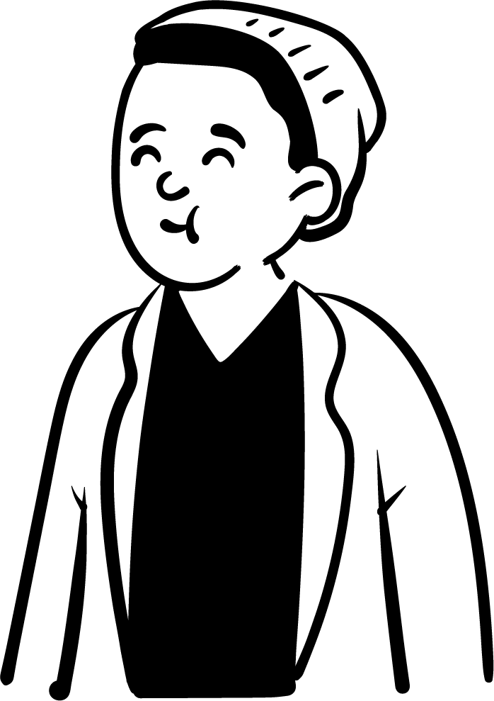

<h3 align="left">
  Hello!
</h3>

  I'm Henrique, a Computer Engineering student. 
  Nowadays I'm focused everyday on improving my <strong>Programming</strong> skills.

  💻 Skills: <strong>HTML5, CSS3, JavaScript, Flutter, C/C++, Java.</strong>

  🧐 Currently Learning: <strong>ReactJS</strong> and <strong>React Native</strong>

  💬 I am open to new proposals, be it new projects, creative ideas or great opportunities. Here are my social networks 👇

  
  
  
  

 
